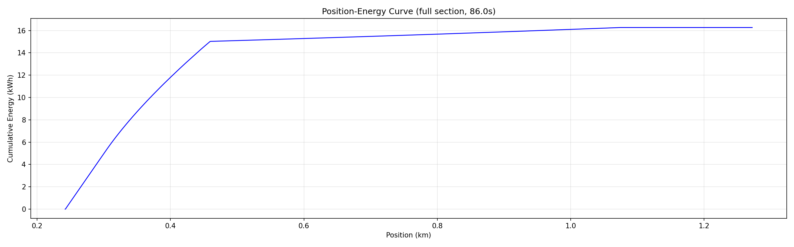

# 列车能耗监控系统 (Train Energy Consumption Monitor)

三层架构的列车能耗实时计算与预测系统。

## 架构

```
Frontend (Vue 3, :5173)
    │  HTTP polling, 1s interval
    ▼
Backend1 (FastAPI, :8000)
    │  HTTP JSON
    ▼
Backend2 (Qt6/C++, :9000)  ←── TDengine (:6041, REST)
```

| 组件 | 技术 | 端口 |
|------|------|------|
| Frontend | Vue 3 + Vite + ECharts 6 + Element Plus | 5173 |
| Backend 1 | Python 3.12 + FastAPI + httpx | 8000 |
| Backend 2 | Qt 6.8 / C++17 + ONNX Runtime (预留) | 9000 |
| TDengine | 3.x Community (taosd + taosAdapter) | 6041 |

## 快速启动

### 环境

- `usecommon` conda 环境: `pip install fastapi "uvicorn[standard]" pydantic httpx numpy`
- Qt 6.8.1: `/home/maksuning/Qt/6.8.1/gcc_64/`
- TDengine 3.x 运行中（taosd + taosAdapter）

### 1. 初始化 TDengine（一次性）

```bash
cd backend1 && conda activate usecommon
python -c "from app.services.init_db import init_database; init_database('../data')"
```

### 2. 构建 Backend 2

```bash
cd backend2/build
cmake .. -DCMAKE_PREFIX_PATH=/home/maksuning/Qt/6.8.1/gcc_64
cmake --build . -- -j$(nproc)
```

### 3. 启动服务

**Backend 2:**
```bash
cd backend2/build
./bin/backend2
```

**Backend 1:**
```bash
cd backend1 && conda activate usecommon
ALL_PROXY="" no_proxy="*" python -m uvicorn app.main:app --host 0.0.0.0 --port 8000
```

**Frontend:**
```bash
cd frontend && npm install && npm run dev
```

### 4. 浏览器打开

`http://localhost:5173` → 选择时间区间 → 确认计算

## API 接口

### 对外（Frontend ↔ Backend1）

| 方法 | 路径 | 说明 |
|------|------|------|
| GET | `/health` | 聚合健康检查（含 TDengine + Backend2 状态） |
| POST | `/vehicle/energy/result` | 能耗计算：返回 5 项能耗指标 + 进度 + 实际曲线 |
| POST | `/vehicle/energy/time_predict` | 能耗预测：返回实际曲线末端 + 预测曲线 |

### 内部（Backend1 ↔ Backend2）

详见 [Backend1-Backend2通信文档.md](./Backend1-Backend2通信文档.md)

| 方法 | 路径 | 说明 |
|------|------|------|
| GET | `/health` | 健康检查 |
| POST | `/internal/calc/energy` | 能耗积分（批量 100 条 1ms 数据） |
| POST | `/internal/predict/train` | 多项式拟合预测（800 条历史数据） |
| POST | `/internal/session/reset` | 会话重置 |

## 数据流

```
流 1（能耗计算，100ms 周期）:
  B1 → TDengine 读取 100 行 (gtm >= t AND gtm < t+100)
     → B2 /internal/calc/energy 积分
     → 返回 5 项能耗指标 + 构建 actual_curve

流 2（能耗预测，100ms 周期，延迟 800ms 启动）:
  B1 → TDengine 读取 800 行 (gtm >= t-800 AND gtm < t)
     → B2 /internal/predict/train 多项式拟合 + 外推 200 步
     → 返回 predicted_curve (201 点)
```

## 能耗物理模型

列车能耗基于物理模型计算，η = 0.85：

| 公式 | 说明 |
|------|------|
| P_mech = F × v | 机械功率 (kW)，F 单位 kN，v 单位 m/s |
| P_dc = P_mech/η (牵引), P_mech×η (制动) | 直流母线功率 |
| P_cat = P_dc − P_bat | 接触网功率 |
| P_consume = max(P_cat, 0) + max(P_bat, 0) | 消耗功率 |
| RTE = P_consume / v_kmh | 实时能耗 (kWh/km) |
| E = Σ P_consume × Δt | 累计能耗 (kWh) |
| E_net = E_traction − E_regen | 净能耗 (kWh) |

电池模型:
- 牵引: 电池提供 30% 功率
- 再生制动: 电池吸收 50% 功率
- 惰行/停站: 辅助功耗 120 kW
- SOC 限幅: 充电截止 99%，放电截止 10%

## 预测方法

**多项式最小二乘拟合**（已替代 MLP/ONNX LSTM）：

1. 提取最近 200ms 历史数据的速度和 RTE 序列
2. 速度: 3 次多项式拟合 `[0, 199] → speed`
3. RTE: 2 次多项式拟合 `[0, 199] → real_time_energy`
4. 外推 200 步 (200ms): `t = 200, ..., 399`
5. 位置积分: `pos += speed/3.6 × 0.001 / 1000` (km)
6. 能量积分: `energy += RTE × speed × 0.001 / 3600` (kWh)

详见 `verify_prediction/verify_polyfit_predict.py` 验证脚本。

## 目录

```
API_COM/
├── frontend/                     # Vue 3 前端
│   └── src/
│       ├── App.vue               # 主组件（轮询、图表、状态管理）
│       ├── main.ts               # 入口（ElementPlus, ECharts 全局注册）
│       ├── api/index.ts          # Axios 客户端
│       ├── types/api.ts          # TypeScript 类型
│       └── components/
│           ├── EnergyChart.vue   # 能耗曲线（vue-echarts）
│           ├── EnergyMetrics.vue # 5 项指标卡片
│           └── TimeRangePicker.vue # 时间段选择器
├── backend1/                     # FastAPI 调度层
│   └── app/
│       ├── main.py               # 应用入口 + CORS + lifespan
│       ├── config.py             # 环境变量配置
│       ├── models/schemas.py     # Pydantic 请求/响应模型
│       ├── routers/
│       │   ├── energy.py         # /vehicle/energy/* 路由
│       │   └── health.py         # /health 路由
│       └── services/
│           ├── scheduler.py      # 核心调度器（calc + predict 双线程）
│           ├── backend2_client.py # Backend2 HTTP 客户端 (async)
│           ├── tdengine_client.py # TDengine REST 客户端
│           └── init_db.py        # CSV → TDengine 初始化（一次性）
├── backend2/                     # Qt6/C++ 计算引擎
│   └── src/
│       ├── Com/server.cpp        # HTTP 路由 + 多项式拟合 (polyfit/polyval)
│       ├── engine/
│       │   ├── physics.cpp/h     # 物理引擎（功率分解、能量积分）
│       │   ├── session_mgr.cpp/h # 会话缓冲区（deque，最大 100k 点）
│       │   ├── dl_infer.cpp/h    # ONNX Runtime 推理（预留）
│       │   └── mlp.cpp/h         # Eigen MLP（预留）
│       ├── config.h              # 端口/超时
│       └── main.cpp              # QCoreApplication 入口
├── data/                         # 原始 CSV (OptReslog.*.csv)
├── verify_prediction/            # 预测验证脚本
│   └── verify_polyfit_predict.py # 多项式拟合验证（动画 + 误差统计）
├── training/                     # LSTM 模型训练
│   ├── train.py                  # PyTorch 训练
│   └── export_onnx.py            # → ONNX 导出
└── tools/
    └── csv_feeder.py             # 独立 CSV 数据馈送脚本
```

## 关键参数

| 参数 | 值 | 来源 |
|------|-----|------|
| 传动效率 η | 0.85 | `init_db.py:16`, `physics.cpp:88` |
| 电池容量 | 200 kWh | `init_db.py:17` |
| 牵引电池占比 | 0.30 | `init_db.py:18` |
| 制动电池占比 | 0.50 | `init_db.py:19` |
| 辅助功耗 | 120 kW | `init_db.py:20` |
| 初始 SOC | 80% | `init_db.py:21` |
| 计算周期 | 100ms | `scheduler.py:131` |
| 预测延迟 | 800ms | `scheduler.py:65` |
| 预测窗口 | 800ms | `scheduler.py:133` |
| 预测步数 | 200 (200ms) | `server.cpp:163` |
| 全线路时间 | 2813s | `scheduler.py:31` |
| 会话超时 | 3600s | `config.h:8` |

## 效果演示

### 能耗曲线

多项式拟合预测（800ms 历史 → 200ms 预测），蓝色为实际能耗曲线，绿色为实际未来曲线，橙色虚线为预测曲线：



### 完整运行效果

<video src="plots/效果.webm" controls width="100%"></video>
